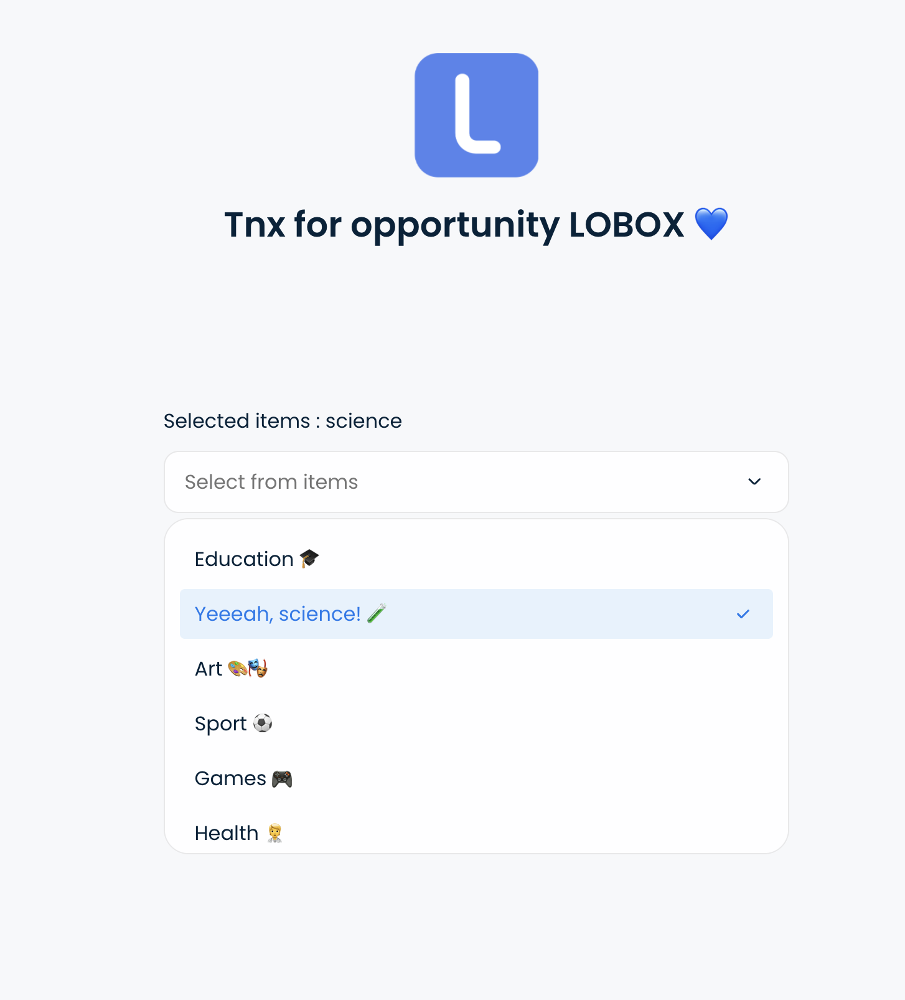

# Combo Selector

This is a React + TypeScript project featuring a reusable multi-select dropdown component with advanced UI/UX features such as:

- 🔍 **Fuzzy search**
- 🎯 **Keyboard navigation with Enter key**
- 🎨 **Icon rendering using SVGR**
- 📦 **Expandable dropdown container**
- 🧠 **Fully typed with TypeScript**
- 🪄 **Scoped styling with BEM**
- 🏗 **Modular SCSS Architecture using 7-1 + ITCSS patterns**
- 🗂️ **Codebase is organized by file type architecture**

---

## 🛠 Tech Stack

- [React 19](https://reactjs.org/)
- [Vite](https://vitejs.dev/)
- [TypeScript](https://www.typescriptlang.org/)
- [SCSS](https://sass-lang.com/)

---

